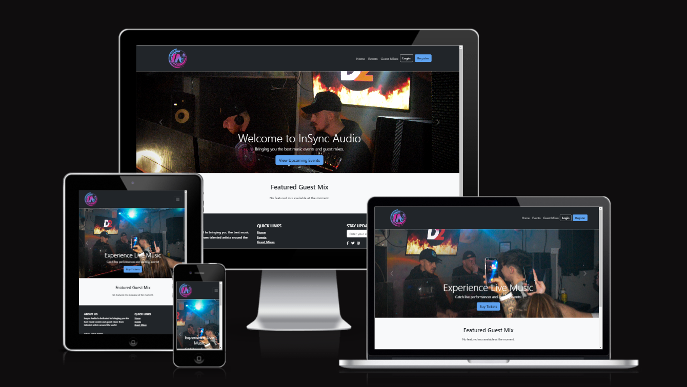
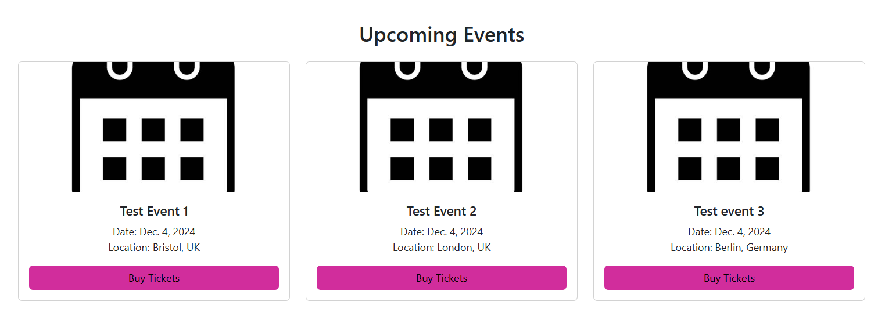
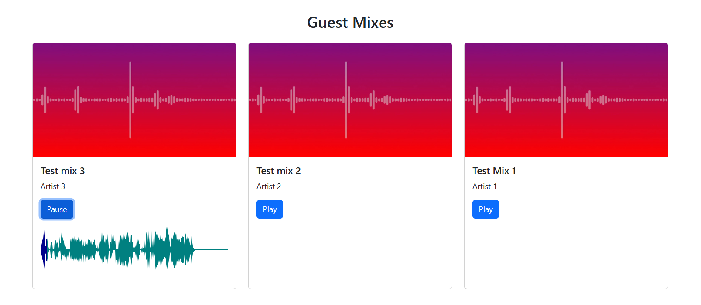
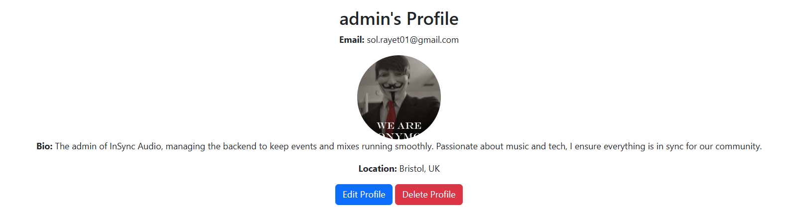
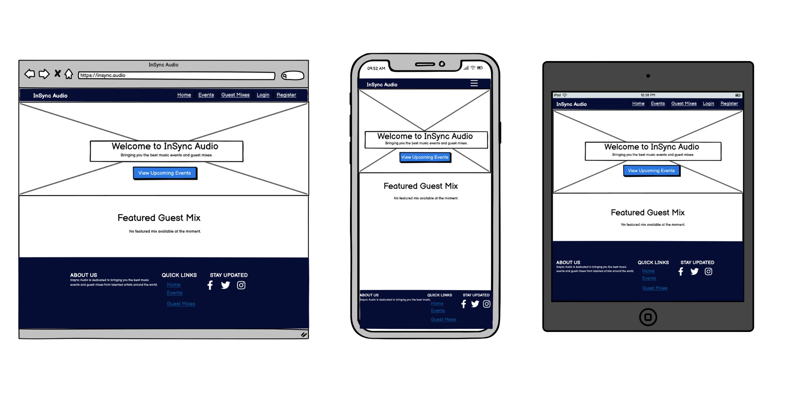

**Student:** Sol Rayet   
**Date:** 25/11/2024   
**Cohort:** WECA - Full Stack Software Developer: Skills Bootcamp  
**Project:** Individual Full-Stack Project

---

# InSync Audio

## Welcome to InSync Audio

View live project here: **[Deployed Application](https://insyncaudio-8e866be95d5d.herokuapp.com/)**

InSync Audio brings you the best in music event management and guest mixes. It offers seamless user interaction with features like account registration, profile management, and event browsing. With a responsive design and an intuitive interface, InSync Audio delivers a top-tier music experience.

---

## Table of Contents

- [Introduction](#introduction)
- [Features](#features)
- [UX Design](#ux-design)
- [Technologies Used](#technologies-used)
- [Project Board](#project-board)
- [Testing](#testing)
- [Deployment](#deployment)
- [Credits](#credits)

---

## Introduction

InSync Audio is a platform dedicated to music enthusiasts. From viewing upcoming events to exploring guest mixes with real-time sound wave visualization, the app provides a user-centric experience. Features like profile management, notifications, and CRUD functionalities empower users to interact effectively.

---

## Features

### Navigation

- **Dynamic Navigation Bar**: Adjusts links based on the user's login status.
- **Responsive Design**: Works seamlessly across all devices.

### Event Listings

- Browse upcoming events with images, dates, and locations.
- "Buy Tickets" links open in new tabs.

### Guest Mixes

- Explore guest mixes with real-time sound wave visualization and play/pause functionality.

### User Profile Management

- Edit your profile information, including bio, location, and avatar.
- Delete your account with all associated data.

### Notifications

- Receive success or error messages for profile edits and account actions.

---

## UX Design

The design focuses on a modern, user-friendly interface that prioritizes usability and aesthetics.

### Wireframes

Wireframes were created using **Balsamiq** to guide the layout and functionality for each page:
- **Home Page**: Carousel, featured guest mix.
- **Events Page**: Grid-based listing of upcoming events.
- **Guest Mixes Page**: Visualized sound waves with play/pause functionality.
- **Profile Page**: Editable fields for personalization and easy account management.

### Accessibility

- **Responsive Design**: Ensures usability on all devices.
- **Clear Visual Hierarchy**: Makes navigation intuitive.
- **Alt Text**: Included for all images for better screen reader support.

### User Stories

- **As a user, I want to**:
  - Register and log in to manage my experience.
  - Browse events and purchase tickets.
  - Explore and listen to guest mixes.
  - Manage my profile, including updating information and deleting my account.
  - Receive notifications for completed actions.

---

## Technologies Used

- **Frontend**: HTML5, CSS3, Bootstrap, JavaScript (WaveSurfer.js for audio visualization).
- **Backend**: Python, Django.
- **Database**: PostgreSQL.
- **Hosting**: Heroku, Cloudinary for media storage.
- **Version Control**: Git and GitHub.
- **Tools**: Balsamiq for wireframes, Chrome DevTools for testing.

---