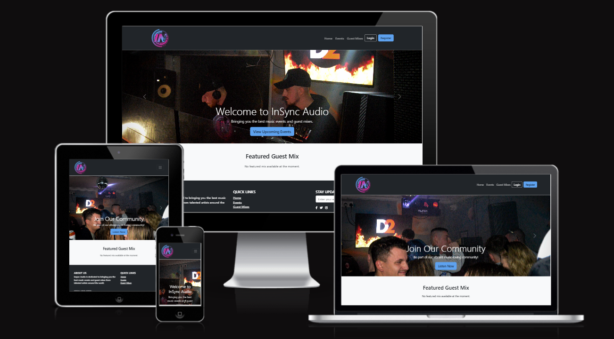

**Student:** Sol Rayet   
**Date:** 25/11/2024   
**Cohort:** WECA - Full Stack Software Developer: Skills Bootcamp  
**Project:** Individual Full-Stack Project

# InSync Audio

## Welcome to InSync Audio

View live project here: **[Deployed Application](https://insyncaudio-8e866be95d5d.herokuapp.com/)**

InSync Audio brings you the best in music event management and guest mixes. It offers seamless user interaction with features like account registration, profile management, and event browsing. With a responsive design and an intuitive interface, InSync Audio delivers a top-tier music experience.

