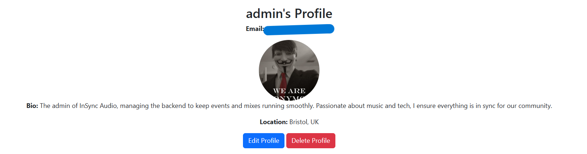

**Student:** Sol Rayet   
**Date:** 25/11/2024   
**Cohort:** WECA - Full Stack Software Developer: Skills Bootcamp  
**Project:** Individual Full-Stack Project

---

# InSync Audio

## Welcome to InSync Audio

View live project here: **[Deployed Application](https://insyncaudio-8e866be95d5d.herokuapp.com/)**

InSync Audio brings you the best in music event management and guest mixes. It offers seamless user interaction with features like account registration, profile management, and event browsing. With a responsive design and an intuitive interface, InSync Audio delivers a top-tier music experience.

---

## Table of Contents

- [Introduction](#introduction)
- [Features](#features)
- [UX Design](#ux-design)
- [Technologies Used](#technologies-used)
- [Project Board](#project-board)
- [Testing](#testing)
- [Deployment](#deployment)
- [Credits](#credits)

---

## Introduction

InSync Audio is a platform dedicated to music enthusiasts. From viewing upcoming events to exploring guest mixes with real-time sound wave visualization, the app provides a user-centric experience. Features like profile management, notifications, and CRUD functionalities empower users to interact effectively.

---

## Features

### Navigation

- **Dynamic Navigation Bar**: Adjusts links based on the user's login status.
- **Responsive Design**: Works seamlessly across all devices.

### Event Listings

- Browse upcoming events with images, dates, and locations.
- "Buy Tickets" links open in new tabs.

### Guest Mixes

- Explore guest mixes with real-time sound wave visualization and play/pause functionality.

### User Profile Management

- Edit your profile information, including bio, location, and avatar.
- Delete your account with all associated data.

### Notifications

- Receive success or error messages for profile edits and account actions.

---

## UX Design

The design focuses on a modern, user-friendly interface that prioritizes usability and aesthetics.

### Wireframes

Wireframes were created using **Balsamiq** to guide the layout and functionality for each page:
- **Home Page**: Carousel, featured guest mix.
- **Events Page**: Grid-based listing of upcoming events.
- **Guest Mixes Page**: Visualized sound waves with play/pause functionality.
- **Profile Page**: Editable fields for personalization and easy account management.

### Accessibility

- **Responsive Design**: Ensures usability on all devices.
- **Clear Visual Hierarchy**: Makes navigation intuitive.
- **Alt Text**: Included for all images for better screen reader support.

### User Stories

- **As a user, I want to**:
  - Register and log in to manage my experience.
  - Browse events and purchase tickets.
  - Explore and listen to guest mixes.
  - Manage my profile, including updating information and deleting my account.
  - Receive notifications for completed actions.

---

## Technologies Used

- **Frontend**: HTML5, CSS3, Bootstrap, JavaScript (WaveSurfer.js for audio visualization).
- **Backend**: Python, Django.
- **Database**: PostgreSQL.
- **Hosting**: Heroku, Cloudinary for media storage.
- **Version Control**: Git and GitHub.
- **Tools**: Balsamiq for wireframes, Chrome DevTools for testing.

---

## Project Board

A project board was maintained to track progress and ensure timely delivery of features. The board included:

- **Backlog**: Tasks for future iterations.
- **To-Do**: Tasks pending implementation.
- **In Progress**: Features currently being developed.
- **Completed**: Finished features ready for deployment.

View the **Project Board**: [GitHub Project Board](https://github.com/users/Rayet01/projects/8/views/1?visibleFields=%5B%22Title%22%2C%22Assignees%22%2C%22Status%22%2C%22Labels%22%5D)

---

## Testing

### Validators

Each page and code type was tested using industry-standard validators.

#### HTML Validation
All HTML files were validated using **W3C HTML Validator**.
- **Home Page**: Passed with no errors or warnings.
- **Events Page**: Passed with no errors.
- **Guest Mixes Page**: Passed with no errors.
- **Profile Page**: Passed with no errors.
- **Register/Login Pages**: Passed with no errors.

#### CSS Validation
All CSS styles were validated using **W3C CSS Validator**.
- **Base Styles**: Passed with no issues.
- **Profile Page Specific CSS**: Passed with no issues.
- **Event Cards CSS**: Passed with no issues.

#### JavaScript Validation
JavaScript files were tested using **JSHint** for any syntax errors or best practice violations.
- **WaveSurfer.js Integration**: Passed with no issues.

#### Python Validation
Python code was validated using **Flake8** to ensure compliance with PEP8 standards.
- **Models**: Passed with no warnings or errors.
- **Views**: Passed with no issues.
- **Forms**: Passed with no issues.
- **URLs**: Passed with no issues.

---

### Manual Testing

#### General Navigation
| **Action**                  | **Expected Result**                             | **Outcome** |
|-----------------------------|------------------------------------------------|-------------|
| Clicking the "Events" link  | Redirects to the Events page                   | Pass        |
| Clicking the "Guest Mixes" link | Redirects to Guest Mixes page               | Pass        |
| Clicking "Edit Profile"     | Redirects to Profile Edit page                 | Pass        |
| Login/Register Button Visibility | Changes dynamically based on user status  | Pass        |

#### Functional Features
| **Feature**                 | **Test Case**                                  | **Outcome** |
|-----------------------------|------------------------------------------------|-------------|
| Registration                | User can create an account with email and password | Pass    |
| Login                       | User can log in and see personalized content   | Pass        |
| Profile Management          | User can update bio, location, avatar, and email | Pass      |
| Profile Deletion            | Deletes account and associated data            | Pass        |

#### Event Listings
| **Action**                  | **Expected Result**                             | **Outcome** |
|-----------------------------|------------------------------------------------|-------------|
| Event Image Display         | Images are the same size and fit within cards  | Pass        |
| "Buy Tickets" button        | Opens the ticket link in a new tab             | Pass        |
| Empty Event State           | Displays a "No events available" message       | Pass        |

#### Guest Mixes
| **Action**                  | **Expected Result**                             | **Outcome** |
|-----------------------------|------------------------------------------------|-------------|
| Play/Pause Button           | Toggles audio playback                         | Pass        |
| Waveform Visualization      | Displays sound waves for the selected mix      | Pass        |
| Empty Mix State             | Displays a "No guest mixes available" message  | Pass        |

---

### Browser Compatibility

The application was tested across major browsers for compatibility:
| **Browser**   | **Result**    |
|---------------|---------------|
| Google Chrome | Fully Functional |
| Mozilla Firefox | Fully Functional |
| Microsoft Edge | Fully Functional |
| Safari        | Fully Functional |

---

## Deployment

1. **Deployment**: Hosted on Heroku with `Procfile` for process management.
2. **Static and Media Files**: Stored using Cloudinary for efficient delivery.

---

## Credits

- **Code Institute LMS**: For foundational lessons.
- **Pexels**: For placeholder images.
- **WaveSurfer.js**: For audio visualization functionality.
- **Community Tutorials**: Inspiration for CRUD operations and dynamic design.
- **ChatGPT**: Assistance with WaveSurfer.js, text content and documentation.

[Back to Top](#insync-audio)